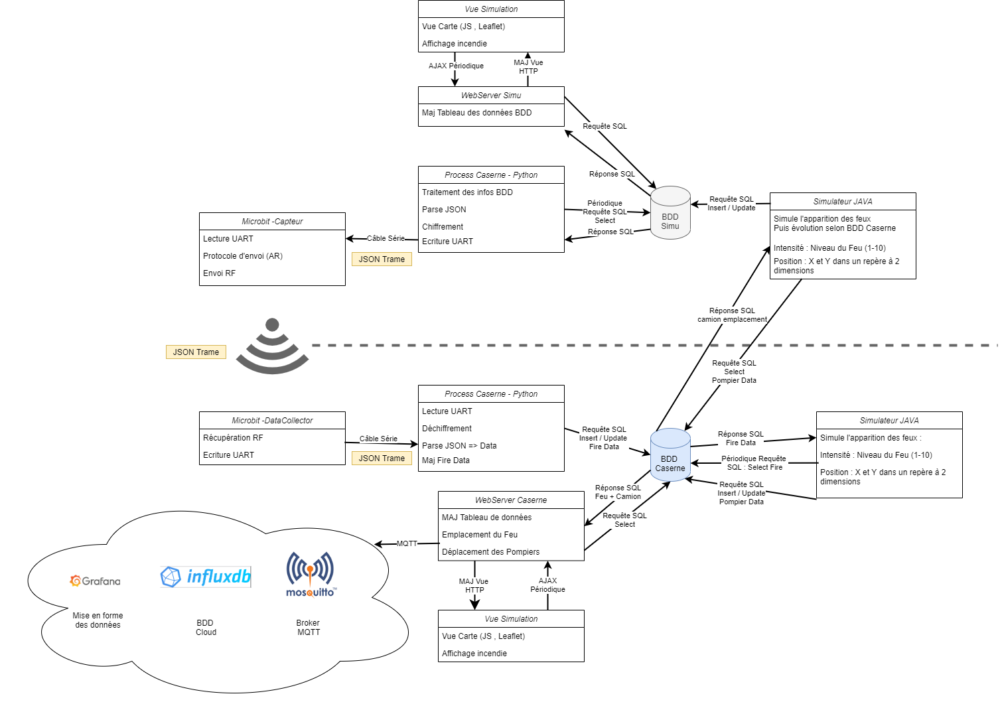

# Projet Transversal Groupe 6
## Contexte

Dans le cadre de notre formation ingénieur informatique nous effectuons ce projet pendant un total de 92 heures par personne soit plus de 268 heures de travail.
Le projet consiste en une simulation de d'incendie avec un dispositif de gestion de services d'urgences permettant d'éteindre ces incendies. Cela s'effectue à travers un ensemble de système permettant l'échange des informations collectées par des capteurs, l'envoie au bon endroit de l'équipe d'intervention, de permettre une visualisation en temps réel de l'évolution du feu et aussi en parallèle le stockage des données pour un aspects statistiques et prévenir le future sur le passé.
Il y aura 4 grandes entités distincts : 

 1. La centrale de simulation 
Correspondrait dans la vrai vie à l'ensemble du systèmes de capteurs placé au sein d'une zone géographique qui renverrait des informations sur l'apparition d'un incendie. A notre échelle cette partie est bien évidement simulé. Cela sera un code java qui permettra de générer des feux déterminées, les données à propos de ces feux seront stockés dans une BD de simulation.

 2. Le Data Center
Cette partie est lié à la gestion d'incendie. Il va recevoir l'ensemble des informations de plusieurs zones géographiques, et les prendre en charge, c'est à dire transmettre si un incendie apparaît à la caserne des pompiers afin qu'il puisse intervenir. Il stocke les informations d'incendies réels. 

3. La caserne 
Récupère les informations liées aux incendies mais seulement réels. C'est à dire qu'il ne va prendre que les données des capteurs où il y a un feu. Il possède un écrans de supervision des casernes, c'est à dire les zone qui sont en feux puis ensuite le déplacement des camions en cours d'intervention. 

 4. La centrale de simulation
Situé dans un réseau totalement distant. Il se trouve dans le Cloud et permet de récupérer un historique de l'ensemble des informations caserne afin de pouvoir réaliser une analyse du passé afin d'améliorer l'avenir. 

 

## Constitution du groupe

| Noms | Partie |
|--|--|
| Antonin POULARD | JAVA et Web |
| Clément PEROT | IOT, Python et C |
| Dorian DUGUE | Web et BD |
| Hugo PETERMANN | Système et Réseau |

## Schéma présentation

### Partie Data

Première partie constituer de plusieurs éléments :

 - **Simulateur** : 
Technologies utilisées : JAVA.
Il va simuler l'ensemble des valeurs relevées par les capteurs. C'est-à-dire, définir une intensité (et son évolution dans le temps) pour un capteur situé à une certaine position.
Pour réaliser cela, on va déterminer par le code des incendies et son évolution dans le temps. Il va donc écrire dans la base de données pour chaque capteur une intensité.
En plus, il va lire en entré les valeurs de la seconde base de données. En effet, s'il y a des pompiers sur place on va devoir simuler la diminution de l'intensité du feu jusqu'à son extinction. C'est de la responsabilité de ce programme java de transmettre les données d'intensité du feu.

 - **BDD** :
Il stocke les informations générées par le simulateur. Il va donc stocker la valeur de chaque capteur et leur position. On va avoir n lignes pour les n capteurs. Comme on ne veut pas à cet endroit l'historique des valeurs on ne stocke pas le temps où ces valeurs sont présentes.
 - **WebServer** :
Il lit la base de données et il écrit ces données vers le microbit par le port série (UART). Il réalise ces deux fonctions en multi threading, un process pour écouter l'UART afin de savoir que la dernière trame a été transmises et qu'il peut transmettre la suivante. Cela afin d'être sur de l'intégrité de l'envoie de données, de n'avoir aucune perte en cours de route. Dans un premier temps on décide de transmettre l'ensemble des données dont l'intensité est supérieur à 0 et dans un second temps nous ne transmettrons que les informations qui ont changé depuis la dernière actualisation.
Il héberge aussi la page de visualisation des données. Qui affiche sur une map l'état en temps réel de chaque capteur.
 - **Capteur** :
Ce composant à un rôle à la fois très simple mais aussi complexe. Il va devoir transmettre l’ensemble des informations (des capteurs) communiqué par UART à la partie Caserne en RF. C'est-à-dire qu'il va recevoir une succession de trame Json, qu'il va devoir retransmettre en étant sûr de sa bonne réception. Il va donc lire 1 Json à la fois en UART, le transmettre en radio en étant sûr de sa réception (Accusé de réception, donc lecture envoie successif), demander le json suivant à l'UART. Cela de façon la plus rapide possible afin que les données de la caserne soit en accord avec les données du simulateur. 

### Partie Caserne

- **Data Collector** : 
Microbit qui va lire en RF une trame, dès qu'elle la bien reçu va la déchiffrer, vérifier son contenu, écrire en UART au WebServer, envoyé l'accusé de réception au capteur afin de valider la réception et au final se remettre en attente de la trame suivante.
 - **WebServer** :
Partie centrale de la Caserne, va lire l'UART, écrire dans la BDD les informations, envoyé les mêmes données dans le cloud et hébergé la visualisation des données en temps réel.
 - **Emmergency Manager** :
Technologies : JAVA
Simule l'intervention des pompiers, selon les valeurs stockées dans la BDD. Il va lire la base de données, déterminer les pompiers à faire intervenir 
 - **BDD** :
Composé de plusieurs tables, il va stocker les informations des capteurs relevant un incendie (intensité > 0), et les informations relatives à la simulation d'intervention des pompiers vers l'incendie. Puis ensuite va écrire dans la BDD la position des camions en cours d'intervention.

### Partie Cloud

Sur un réseau distant contient plusieurs composants:
 - **WebServer** :
Point d'entré dans cette partie. Il va récupéré les informations du WebServer de la partie Caserne. Puis les insérer dans la BDD. 
 -  **BDD** :
Sensiblement la même que la partie Caserne. Il stocke l'ensemble des informations dans le temps afin de pouvoir faire des visualisations plus complexes et statistiques sur le temps. 
 -  **Visualisation** :
Rendu visuel des informations de la BDD.

### Résultat Final

## Architecture réseaux

## Structure BD
### BDD 1

### BDD 2

### BDD 3

## Diagramme de classes

## Diagramme de séquence

## Format JSON
La communication entre le Data Center et la Caserne dans le système se fait par échange de trame en JSON. Cela pour des raisons de facilité d’implémentation et de rapidité au sein de ce module. 
Pour s'assurer du bon traitement à effectuer sur les acteurs du système un duo source/destination a été mis en plus en ce qui concerne le JSON.
Définition des acteurs :

| ID| Description|
|--|--|
| WbSv1 | Le Web Server côté Data Center, prenant en entré les informations simulées |
| Cpt | Le Microbit Capteur, envoyant les informations à la seconde Microbit en RF |
| DtCl | Microbit DataCollector, récupérant les informations en RF |
| WbSv2 | Web Server côté Caserne, stockant dans la BD les informations des feux |

La dualité mis en place :

| Source | Destination| Description |
|--|--|--|
| WbSv1 | Cpt  | Tranmission UART : Envoi des données Capteur, Position, Intensité |
| Cpt | DtCl  | Transmission RF : La même trame |
| DtCl | Cpt | Transmission RF: Accusé de réception |
| DtCl | WbSv2  | Transmission UART : Ecriture de la trame |

La structure du JSON est la suivante :

    {
	    Source : < ID >,
	    Capteur : < n° >,
	    PosX : < x >,
	    PosY : < y >,
	    Intensite : < Val >
	}

## Chiffrement 
Nous avions dans un premier temps d'effectuer le Chiffrement par les microbit et donc nous avions choisi un protocole de chiffrement de Vigenère, facilement implémentation sur les cartes. Mais en fin de compte nous avons fait le choix de chiffrer les données par AES puisque le (dé)chiffrement s'effectue par les WebServer qui possède plus de ressource. Améliorant ainsi la sécurité de notre échange d'information.
Le principe est que chaque côté (WebServer) possède la même clé en dure dans leur code, ce qui permet de chiffré et déchiffré de la même manière.

